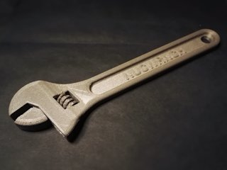
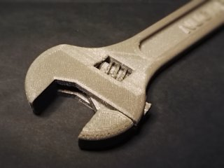
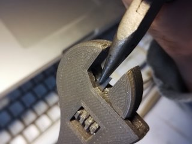

# Fully assembled more 3D printable wrench (customizable)
*3D printable print-in-place adjustable wrench, no assembly required*

### Attribution
This is a remix of barspin's Fully assembled 3D printable wrench [Thingiverse thing:139268](http://www.thingiverse.com/thing:139268).

### License
[Creative Commons - Attribution](https://creativecommons.org/licenses/by/4.0/)

### Gallery

[🔎](images/photo1.jpg) [🔎](images/photo2.jpg)

## Description and Instructions

This is a straightforward remix of barspin's (aka Daniel Norée) famous 3d printable wrench, with as main goal making it less frustrating to print and get working. Things I changed in this remix:

* The supports have a smaller contact area with the model at their undersides, and have larger clearances at their sides. The supports from the original model are very difficult to remove for no good reason, because they hug the model both at their top and underside. There is no reason to place the underside of the supports so close to the model, it only helps to get a nice finish on the supports themselves, which will be destroyed anyway.
* I hollowed out the lower parts of the supports, so your printer doesn't spend time and filament on those parts if you print the wrench with a high infill.
* The ridges on the jaw that match the wheel, are slanted because the ridges on the wheel are also slanted. This makes the wheel easier to turn and reduces the risk that these parts get fused during printing.
* The tolerance on the wheel has been increased slightly so it will turn more easily.
* I added 0.2 mm to the underside of the model, to allow to make the wheel more complete. I used the extra 0.2 mm to add a tiny raft. This makes the wheel easier to print and reduces the risk that the small ridges get knocked over during printing of the first few layers. You will need to carefully carve this raft with a sharp knife to get a nice round shape on the entire wheel.
* Version without text available.
* Can be customised through OpenSCAD's Customizer, see below.

### Making a customised model

You can generate your own custom model of this wrench by **[using the OpenSCAD Customizer](https://www.dr-lex.be/3d-printing/customizer.html)**. The Customizer allows to add custom text or toggle options like built-in supports or larger gap. Copy the `More_Printable_Wrench-customizable.scad` file and the `raw_parts` directory to your own computer, and ensure all variants of the fonts *‘Roboto’* and *‘Roboto Consensed’* are installed on your system. Then open the `scad` file in [OpenSCAD](https://www.openscad.org/).

### Printing

The `dual` files are meant for dual material printers.

I printed the regular model in ABS at 0.1 mm layer height, 25% infill, with 3 perimeters, 4 bottom and 5 top solid layers for extra strength and a nice finish.

Do not enable supports when printing the model with built-in supports.

If you have a cooling fan, make sure it blows at full power while the jaw parts are being bridged across the main part, and vice versa. This is especially important with filaments like PLA or PETG. It will reduce adhesion between those layers, which will be very helpful when trying to detach the parts after printing.

### Post-printing

Removing the supports will be a lot easier than on barspin's original model. However, be prepared to still spend about an hour until you have either a working wrench, or a pile of broken plastic.

Despite the easier to remove supports, you still need to ensure that their smaller fragments are removed from the inside of the wrench as well. A sharp knife like an X-acto will be very helpful, and is essential as well to remove the mini-raft from the wheel. Try to carve the raft so you get a nice round shape on the ridges.

The most difficult thing is to get the jaw to move. The design is not very good in this regard, there simply is a large part where layers that are supposed to be disconnected, are printed on top of each other with no proper bridge attachment points. No matter how much clearance is provided, the filament will not simply hover in the air, it will drop down and especially PLA will have enough heat capacity to fuse with the underlying layers.

If the regular model keeps on being fused together no matter what you try, you can try the model with larger gaps, but it risks ending up rather sloppy to be a convincing crescent wrench.

[🔎](images/postproc.jpg)

What seems to work reasonably well, is to shove a thin piece of metal, like a segment of disposable cutter blade, in between the jaw and the rest as shown on the photo. You can also wedge a screwdriver in between the gaps at the wheel. However, the way in which I eventually got my print to move, was to apply enough force on the jaw that the whole thing simply broke apart. This allowed me to smooth out the parts, after this I re-assembled it and repaired using ABS slurry as glue. Kind of defeats the whole print-in-place thing, but better than having a fused piece of plastic.

## Updates

### 2017/05/23
Added dual extrusion models, and customizer to change the text.

### 2017/06/19
Fixed the broken customizer after a long and tedious battle against bugs in OpenSCAD/CGAL. Apparently it cannot handle combining polyhedra very well, so I resorted to just importing the model twice. As a side effect of my attempts to work around the bug, the model produced by customizer is now slightly cleaner than the original, but you probably won't notice this in normal prints.

### 2017/06/24
Optimised the Customizer file again so the workaround is no longer necessary, by further cleaning up the model.

### 2021/01/16
Moved to GitHub. Since we no longer have to care about limitations of Thingiverse's (broken anyway) customizer, get rid of polyhedra and import STL files directly. Supports and larger gaps can now be toggled in Customizer, and text can be set to the second colour for multi-material printing.

## Tags
`3dprintable`, `adjustable_end_wrench`, `adjustable_spanner`, `assembled`, `crescent_wrench`, `customizer`, `dual_extrusion`, `moving_parts`, `spanner`, `tool`, `wrench`
